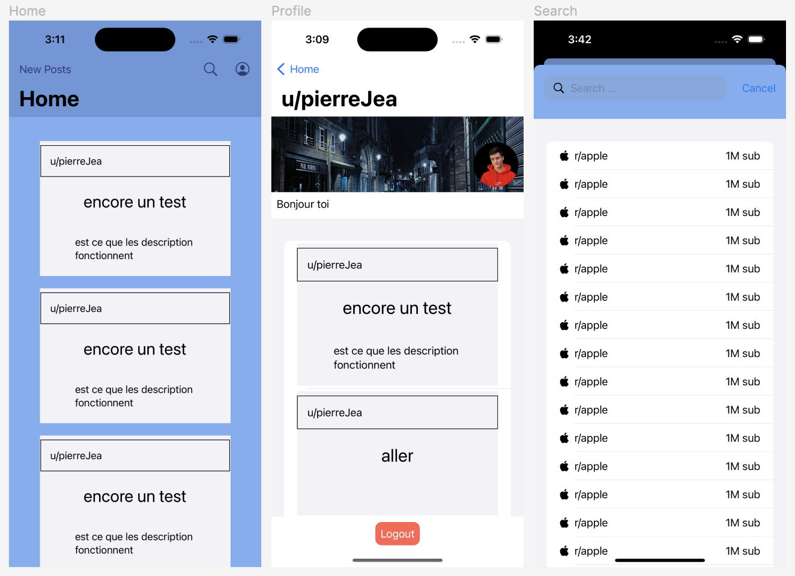

# Redditech

Pierre Jeannin Final Project for CSC-680

The goal of this application is to create an alternative to the Reddit application.
As they have a public API, I would like to be able to log in with OAuth2.
Then load, and maybe interact, with the new/top/hot posts of the user.
Allow the user to see his profile, and maybe edit some part of it.
And last I would like to be able to search for a subreddit, display the lasts posts of it and subscribe or unscubscribe to it.

## Features
Login with OAuth2
Display the new/top/hot posts of the user
Display the profile of the user
Display the last posts of the user
Edit some users settings
Search for a subreddit
Display the last posts of a subreddit
Subscribe/Unsubscribe to a subreddit
See picture in fullscreen when tap on it
See ups/downs of a post